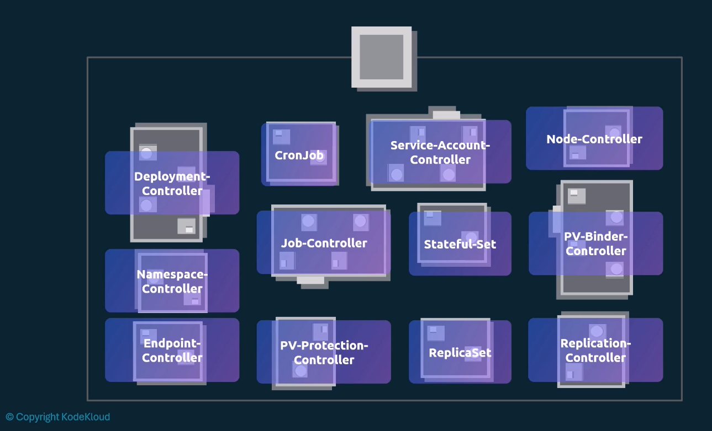

# Controller Manager

Controller Manager is a bundle of controller monitoring different aspects of the cluster. 
The controllers continuously watch the state of the cluster and make changes to move the current state towards the desired state.

# Kube-controller-manager
Kube-controller-manager is a daemon that embeds the core control loops shipped with Kubernetes.

## EXAMPLE - Node Controller
1. Monitors the health of the worker nodes every NODE_MONITOR_PERIOD=5s via kube-apiserver.
2. The kube-apiserver queries the kubelet on the worker node for its health status.
3. Successful responses indicate that the node is healthy - called a heartbeat.
4. If the controller fails to receive a heartbeat from a node for NODE_MONITOR_GRACE_PERIOD=40s, it marks the node as unreachable.
5. After POD_EVICTION_TIMEOUT=5m, the controller will evict all pods from the unreachable node and reschedule them to other healthy nodes.

## EXAMPLE - Replication Controller
1. Ensures that a specified number of pod replicas are running at any given time.
2. If there are too many replicas, it will delete the excess pods.
3. If there are too few replicas, it will create new pods to meet the desired count.

