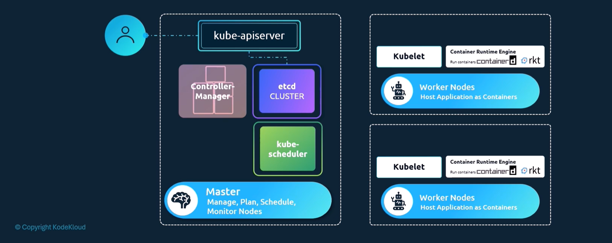

# Kube-apiserver



Kube-apiserver is the entry point for user requests, be it via kubectl or REST API.

```bash
kubectl get nodes
```

1. The command is sent to the kube-apiserver, which is the entry point for all requests.
2. The kube-apiserver authenticates and validates the request.
3. The kube-apiserver queries the etcd database for the cluster state.
4. The kube-apiserver returns the result to the user.


```bash
curl -X POST /api/v1/namespaces/default/pods ...
```

1. The request is sent to the kube-apiserver, which is the entry point for all requests.
2. kube-apiserver authenticates and validates the request.
3. kube-apiserver updates the etcd database with the new pod information.
4. The scheduler is notified of the new pod and schedules it to a worker node based on resource availability.
5. The scheduler updates the kube-apiserver with the assigned worker node.
6. The kube-apiserver updates the etcd database with the new pod information, including the assigned worker node.
7. The kube-apiserver send that information to the kubelet on the assigned worker node.
8. The kubelet creates the pod on the node and starts the containers.
9. The kubelet updates the kube-apiserver with the pod status.
10. The kube-apiserver updates the etcd database with the pod status.