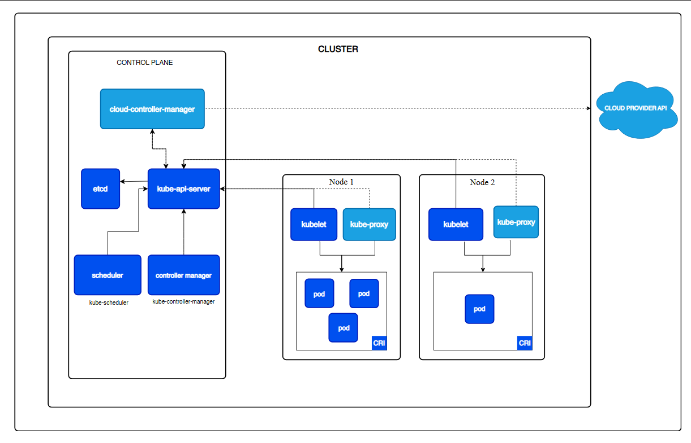
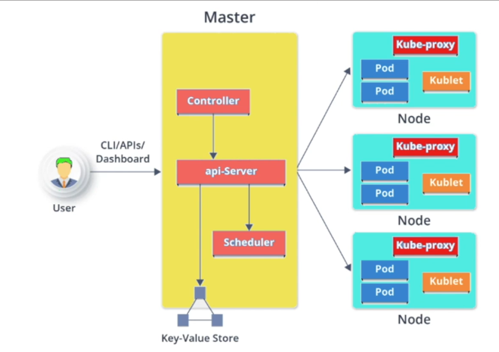
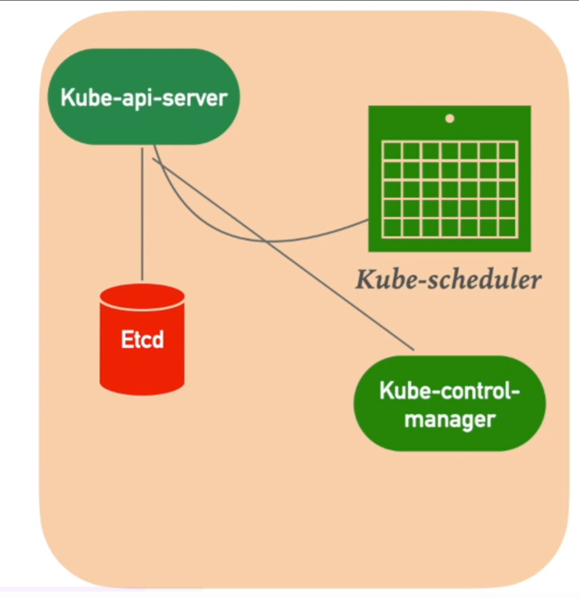
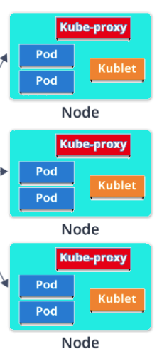

# Architecture
https://kubernetes.io/docs/concepts/architecture/

## CLUSTER

- Can have one or multiple master nodes, one or multiple slave (worker) nodes.

## MASTER NODE

- Manages the worker nodes and the pods in the cluster

### Api server
- Accepts user requests via REST api

### Etcd
- Key-value store for the cluster state
- Can be stored outside of the cluster or synced across multiple master nodes
- Can be used to recover the cluster if it's lost/broken

### Scheduler
- Monitors worker nodes resources
- Regulates tasks on the worker nodes
- Schedules jobs

### Control manager
- Runs all automated jobs within the cluster

## WORKER NODE

- Managed by the master node
- A physical machine or a VM that runs the containers
- Contains all services need for networking between containers/workers/master
- Can assign resources to containers

### KUBELET
- K8s agent running on the worker node
- Reads the Pod config from the api server and ensures that described containers are running

### Kube-proxy
- Manages subnetting
- Exposed nodes for external connections

### POD
- Group of one or more containers that share storage, network and run specification
- Single IP per pod, not per container

## TWO WAYS TO INSTALL
### High Availability Deployment
- One master node, two worker nodes
- Production suitable
    
### Minikube
- One node
- Suitable for development/testing