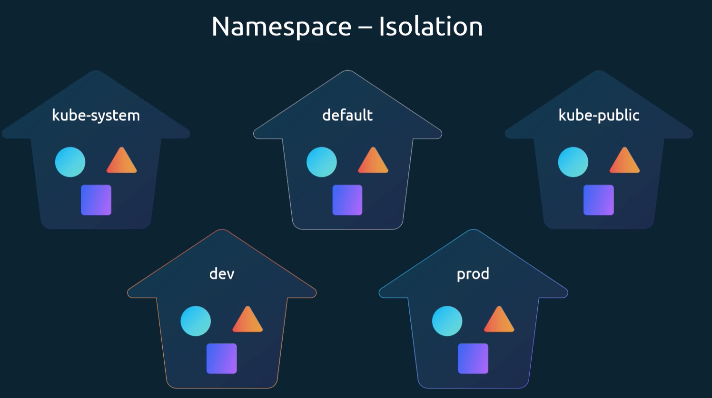
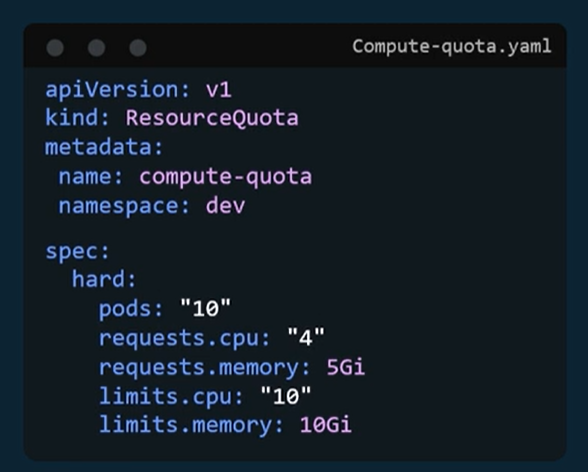
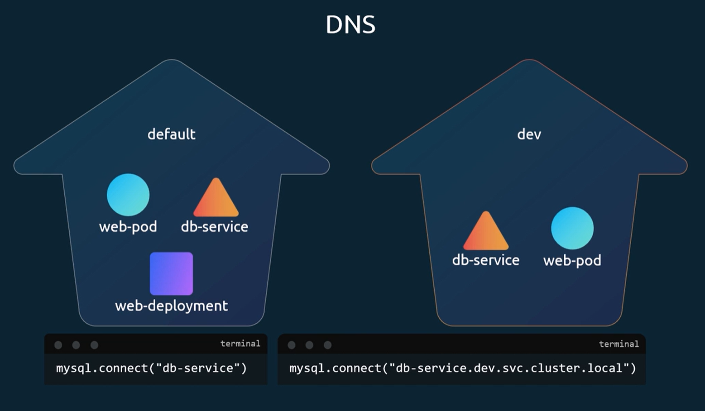
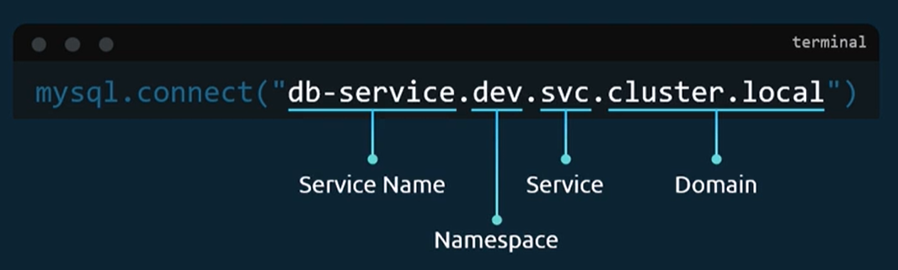
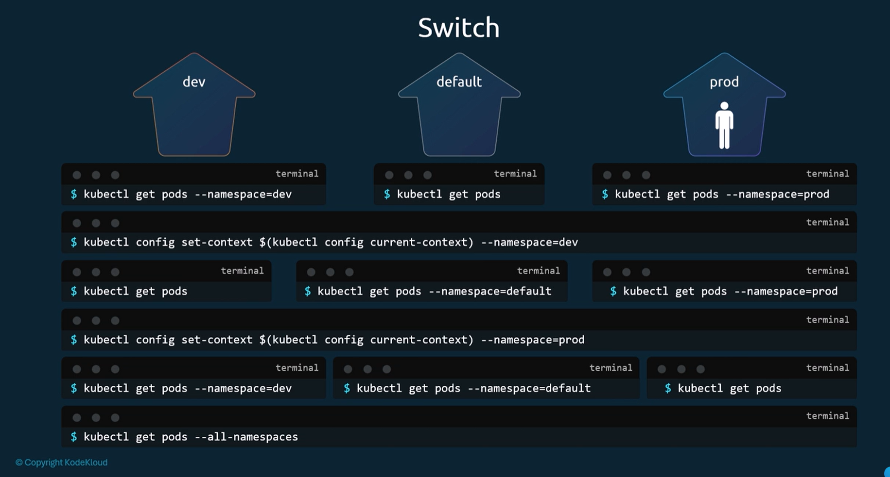

# Namespaces
Namespaces allow separation of resources within a Kubernetes cluster.
They also allow to assign a resource quota to a namespace, which limits the amount of resources that can be used by the objects in that namespace.

Creating an object in cubernetes creates DNS entries for the object. If we want to access an object in the same namespace, we can simply use its name. If we want to access an object in a different namespace, we need to use its full name, which includes the namespace, the object name, and the cluster domain.

You can switch the default namespaces

