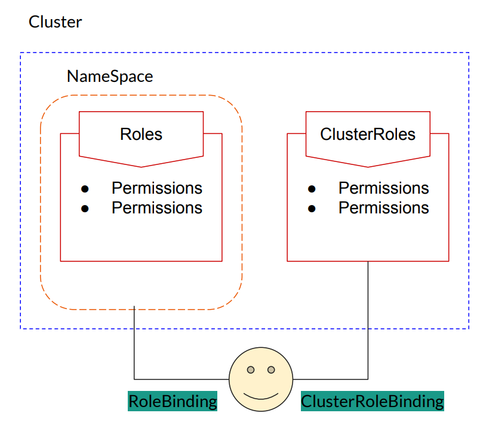

## Key Concepts

### RBAC - Role-Based Access Control
- A method for regulating access to resources based on the roles of individual users within an organization.
- In Kubernetes, RBAC is used to control who can access the Kubernetes API and what actions they can perform.



- **Role** and **ClusterRole** are K8s Objects that define a set of permissions.
- **Role** is namespace-scoped, while **ClusterRole** is cluster-scoped.

- **RoleBinding** Objects connect Roles to users.
- **ClusterRoleBinding** Objects connect ClusterRoles to users.

### yaml Examples 
https://kubernetes.io/docs/reference/access-authn-authz/rbac/

- Role Example:
```yaml
apiVersion: rbac.authorization.k8s.io/v1
kind: Role
metadata:
  namespace: default
  name: pod-reader
rules:
- apiGroups: [""] # "" indicates the core API group
  resources: ["pods"]
  verbs: ["get", "watch", "list"]
```

- RoleBinding Example:
```yaml
apiVersion: rbac.authorization.k8s.io/v1
# This role binding allows "jane" to read pods in the "default" namespace.
# You need to already have a Role named "pod-reader" in that namespace.
kind: RoleBinding
metadata:
  name: read-pods
  namespace: default
subjects:
# You can specify more than one "subject"
- kind: User
  name: jane # "name" is case sensitive
  apiGroup: rbac.authorization.k8s.io
roleRef:
  # "roleRef" specifies the binding to a Role / ClusterRole
  kind: Role #this must be Role or ClusterRole
  name: pod-reader # this must match the name of the Role or ClusterRole you wish to bind to
  apiGroup: rbac.authorization.k8s.io
```


## Creating users

### Using certificates
- Create a private key and a certificate signing request (CSR) for the user.
- Sign the CSR with the cluster's Certificate Authority (CA) to generate a user certificate.
- Configure kubectl to use the user certificate and key for authentication.

1. Generate a private key and CSR:
```bash
openssl genrsa -out keyname.key 2048
openssl req -new -key keyname.key -out keyname.csr -subj "/CN=username/O=groupname"
```

2. Sign the CSR with the cluster's CA:
```bash
openssl x509 -req -in keyname.csr -CA ca.crt -CAkey ca.key -CAcreateserial -out username.crt -days 365
```
You can type
```bash
kubectl config view
```
to find the location of the certificate authority files (ca.crt and ca.key).

3. Add the user to your kubeconfig file:
```bash
kubectl config set-credentials username --client-certificate=username.crt --client-key=keyname.key
```
Run 
```bash 
kubectl config view
``` 
and verify under users that the new user has been added.

4. Create and set the context for the user:
```bash
kubectl config set-context username-context --cluster=clustername --namespace=default --user=username
```
You might want to create a new namespace for the user instead of using the default one.


## Service accounts
- A special type of account used by containers running in pods to interact with the Kubernetes API.
- We can create service accounts and assign them Roles or ClusterRoles using RoleBindings or ClusterRoleBindings.
