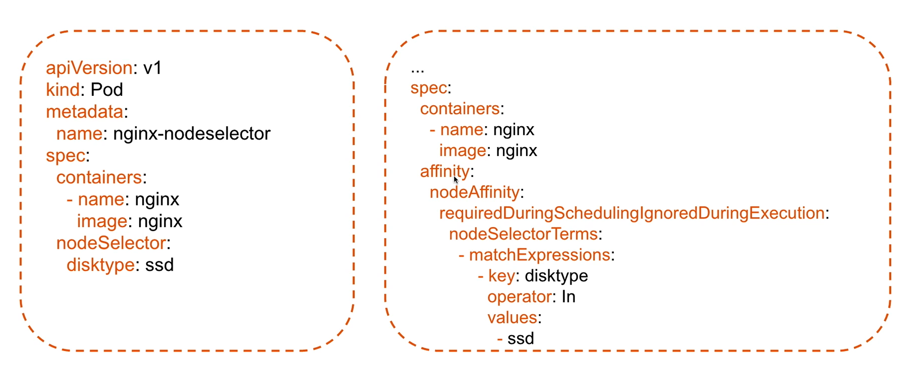

# NodeSelector and NodeName

The `nginx-nodeselector` and `frontend-app` pods in the [selector example](./selector.yml) require a node with label `disktype: ssd` to run. The scheduler will look for a node with that label and schedule the pod on it. If no such node is found, the pod will remain in a pending state until a suitable node becomes available.

```yml
...
spec:
  nodeSelector:
    disktype: ssd
...
```

To add a label to a node, you can use the following command:

```bash
kubectl label nodes <node-name> disktype=ssd
```


Similarly, the `nginx-nodename` pod requires a node with the name `k8s-worder-01` to run.

```yml
...
spec:
  nodeName: k8s-worker-01
...
```

# Affinity vs Selector example


# Node Affinity and Anti-Affinity
For example config check [here](./affinity.yml)

## types
### RequiredDuringScheduling (Hard Affinity)
- Must fulfill the condition during pod creation/scheduling

### PreferredDuringScheduling (Soft Affinity)
- Will try to fulfill the condition during pod creation/scheduling, but if it can't, the pod will still be scheduled on a node that doesn't meet the condition

### IgnoredDuringExecution
- Pod will still run even if the node no longer meets the condition after scheduling

## Affinity vs Anti-Affinity selector
- Affinity: Pod should be scheduled on a node that meets the condition
- Anti-Affinity: Pod should not be scheduled on a node that meets the condition

```yaml
...
spec:
  affinity:
    nodeAffinity:
      requiredDuringSchedulingIgnoredDuringExecution:
        nodeSelectorTerms:
        - matchExpressions:
          - key: disktype
            operator: In # NotIn, Exists, DoesNotExist, Gt, Lt
            values:
            - ssd
...
```