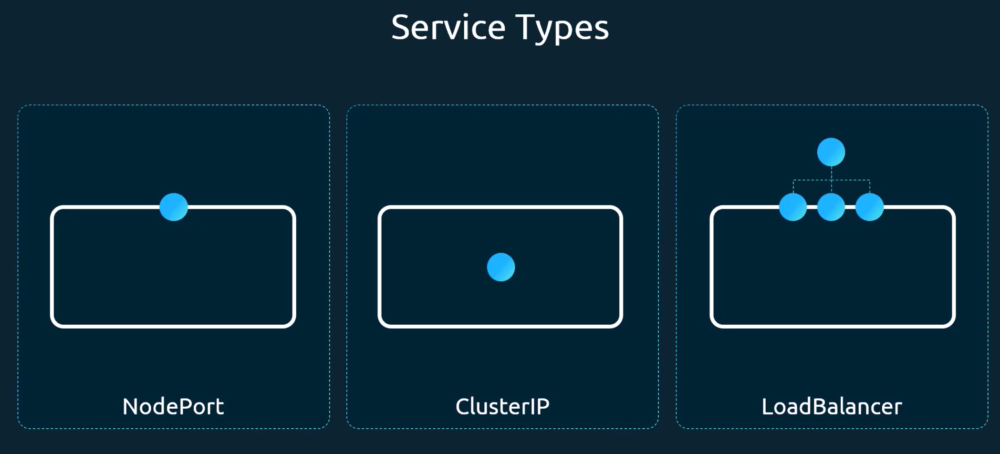
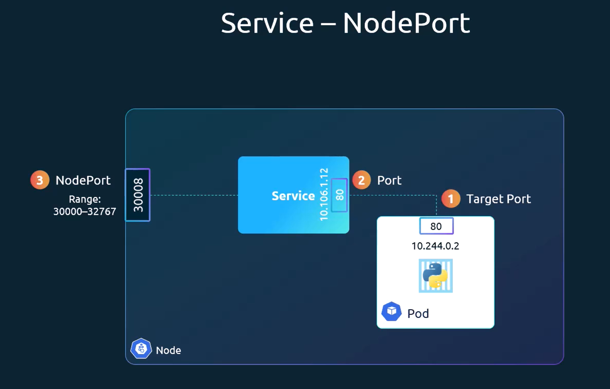
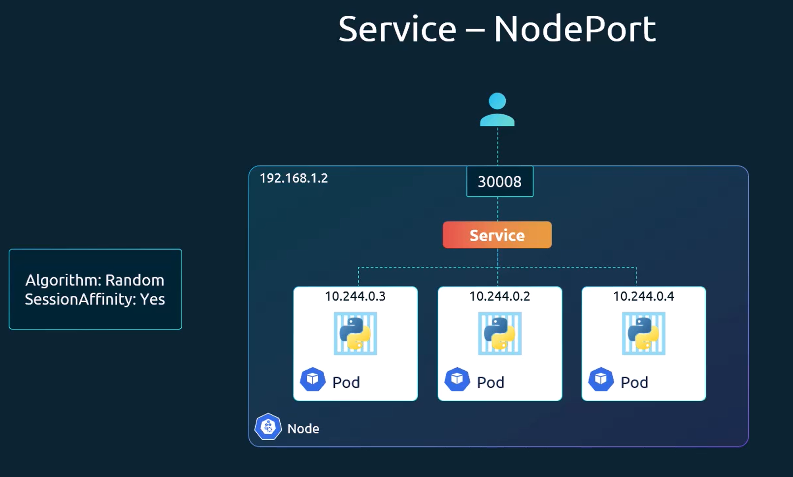
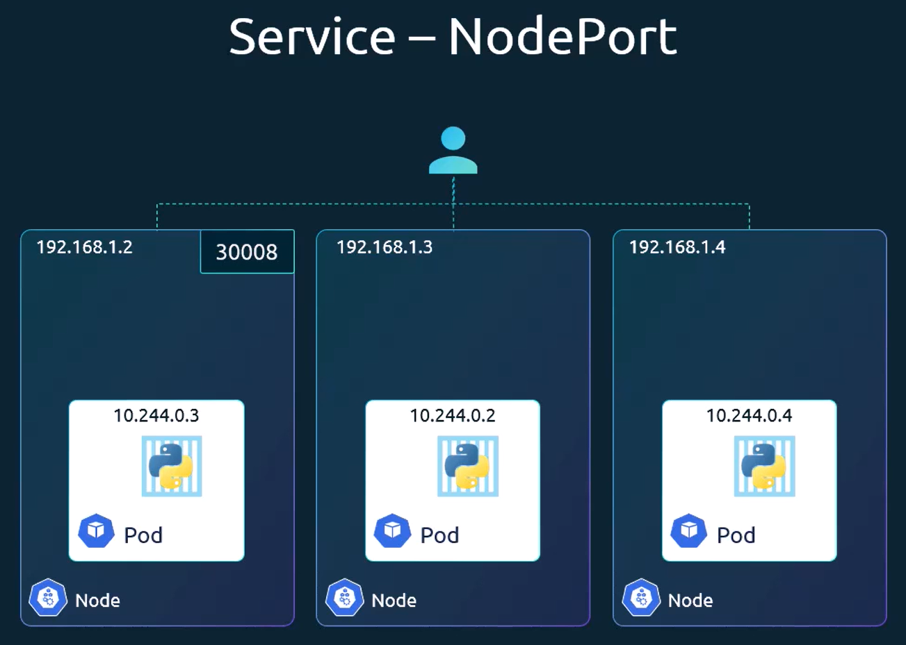
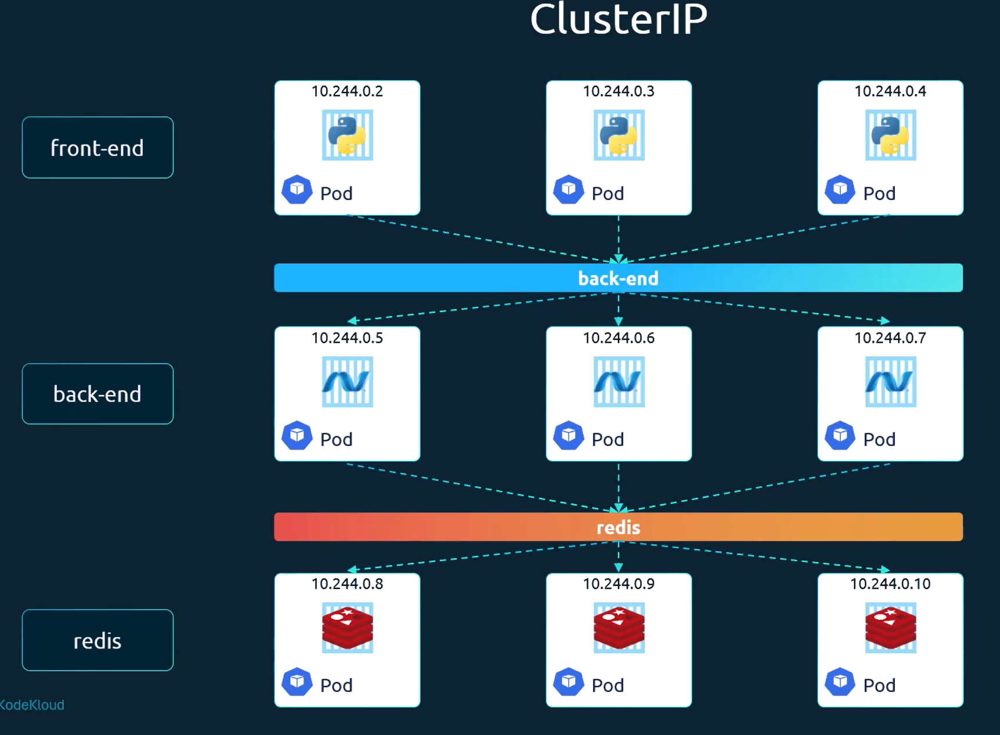

# Kubernetes Services

## Service types

## NodePort
Provides a static port on each node's IP address that forwards traffic to the service. This allows external traffic to access the service using the node's IP and the specified port.

The NodePort service will route traffic to all pods that match the service's selector. This means that if you have multiple pods running the same application, the NodePort service will randomly distribute traffic among them.

The NodePort service will span multiple nodes in the cluster automatically, if the pod is distributed across multiple nodes.

## ClusterIP
Provides a stable internal IP address for a pod or a set of pods based on a selector. This allows pods to communicate with each other using the stable IP address of the service, without needing to know the IP addresses of individual pods. 
As pods are ephemeral and can be created and destroyed dynamically, the IP address of a pod can change over time.

